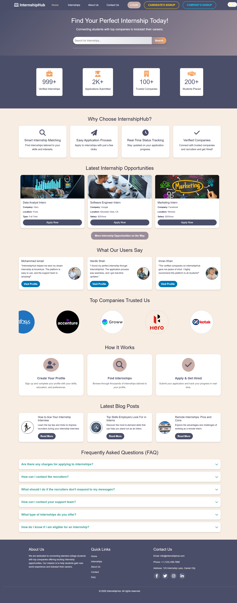
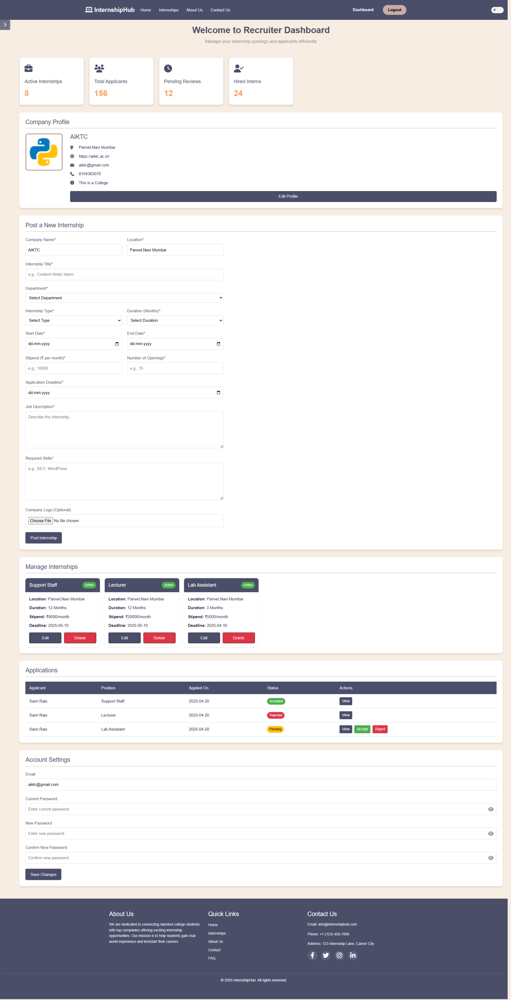
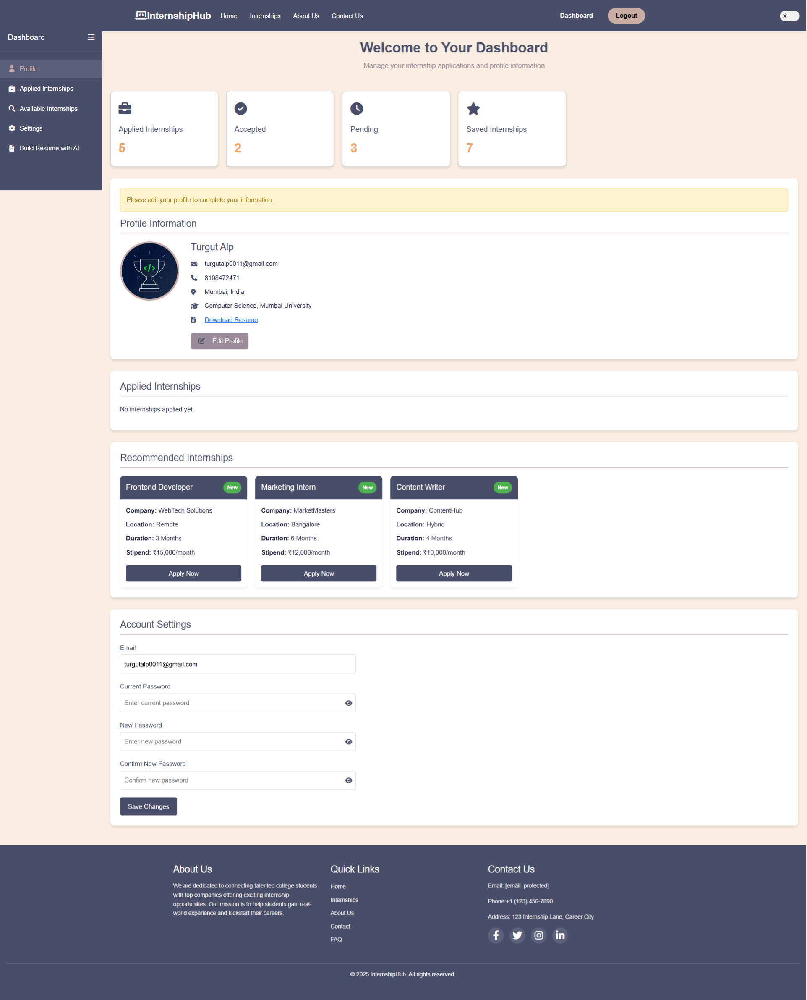
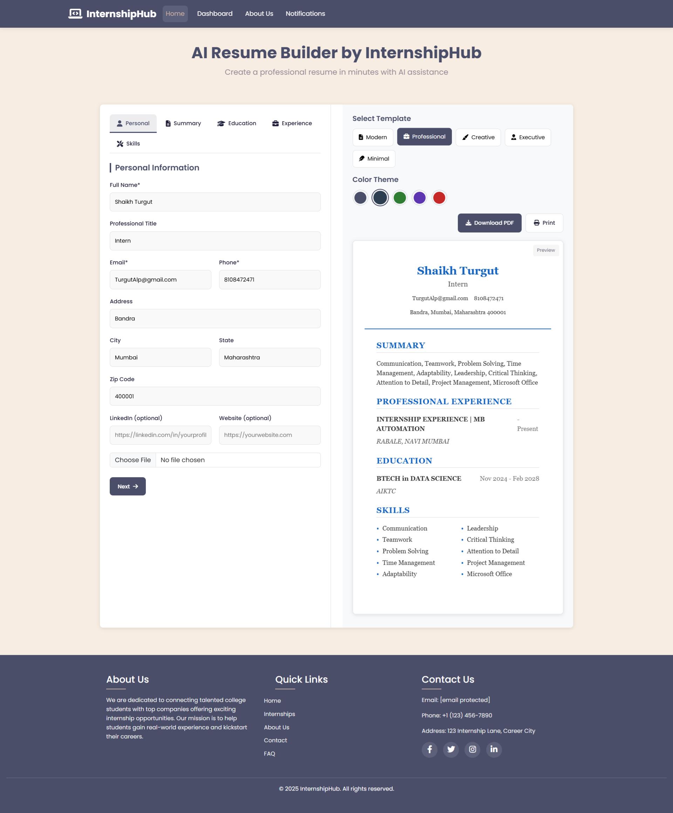

# Student Internship Management System

A full-stack web application designed to streamline the internship process for students and companies. Built using Flask and MySQL, it features secure login, dashboards, internship postings, applications, and a unique resume builder.

## 🚀 Features

- Secure login/signup for students and companies
- Dashboards for managing profiles, internships, and applications
- Internship posting and editing for companies
- One-click apply for students
- AI Resume Builder with multiple templates (unlimited resume generation)
- Application tracking system
- Conditional navbar based on login status
- Responsive design and user-friendly UI

## 🛠 Tech Stack

- **Frontend**: HTML, CSS, JavaScript
- **Backend**: Flask (Python)
- **Database**: MySQL
- **Styling**: Bootstrap, FontAwesome, SweetAlert2

## 📷 Screenshots

### 🏠 Home Page

### 🔐 Login Page

### 🧑‍💼 Recruiter Dashboard

### 🧑‍🎓 Student Dashboard

### 🧾 Resume Sample (Builder)

## 👨‍💻 Contributors

- Shaikh Mudassir Ahmed - [LinkedIn](https://www.linkedin.com/in/shaikh-mudassir-6a909b351)

## 📄 License

This project is licensed under the MIT License.
